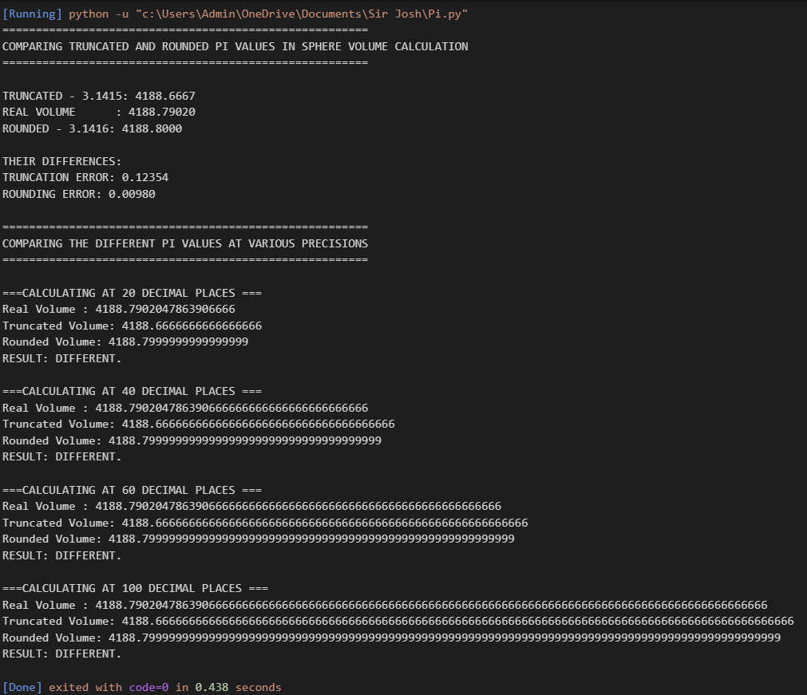

### Interpretation
- Truncation **underestimates** the true volume.
- Rounding produces a value **closer to the true volume**.
- The truncation error is significantly larger than the rounding error.

This shows that **rounding is more accurate than truncation** when approximating π.

---

## Part B: Precision Comparison (20, 40, 60, 100 Decimal Places)

This section tests whether increasing decimal precision changes the results.

For each precision level, the program prints:
- True volume
- Truncated volume
- Rounded volume
- A comparison result

### Output

### Observations
- As precision increases, **more digits of the true value are revealed**.
- The truncated and rounded volumes **remain different** from each other and from the true value.
- Increasing precision does **not fix the initial approximation error** caused by truncation or rounding.

---

## Conclusions
- Truncation introduces a **larger numerical error** than rounding.
- Rounding consistently gives a **closer approximation** to the true value.
- Increasing decimal precision improves numerical representation but **does not eliminate approximation error**.
- The choice of numerical method is critical in **computational science and scientific modeling**.

---

